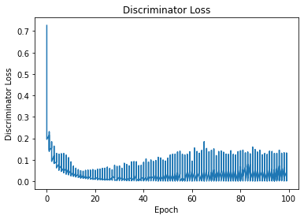

# Generating-Fake-Images-of-MNIST-dataset-using-Vanilla-Adversarial-Autoencoder

Using adversarial autoencoder we are generating the images of MNIST dataset after training the Encoder, Decoder and Discriminator network.

# Generated Images

# Encoder and Discriminator Losses

# MSE Loss

